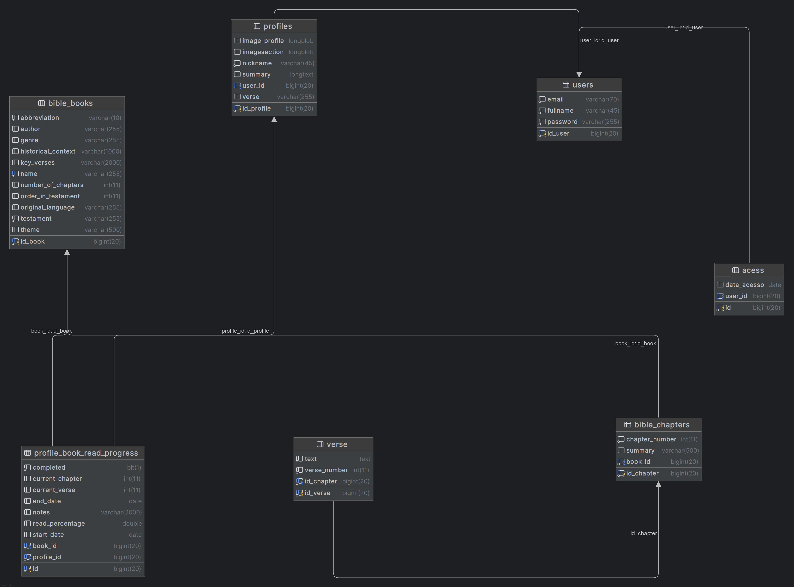

# Sistema Integrado em Java e Web

Este repositório apresenta um **Sistema Integrado desenvolvido em Java para o backend e utilizando HTML/CSS para a interface de usuário (frontend)**.

O projeto tem como objetivo principal **proliferar a palavra cristã, tendo recursos para ajudar o usuário final.**.

## Visão Geral do Projeto

O sistema é estruturado em duas camadas principais:

* **Backend (Pasta `app/`):**
    * Desenvolvido em **Java**.
    * Responsável por toda a **lógica de negócios**, a **manipulação e persistência de dados** (conectando-se a um banco de dados **MariaDB**).
    * Engloba a construção robusta do sistema e a interação com a base de dados.
    * Tecnologias principais utilizadas: Java e bibliotecas ex: Spring Boot, JDBC, 

* **Frontend (Pasta `html-css/`):**
    * Composto por **páginas HTML** para a estrutura e conteúdo da interface.
    * Estilizado com **CSS** para garantir uma apresentação visual agradável e responsiva.
    * Define a "Estrutura das páginas HTML" conforme a descrição do commit.

## Diagrama do Banco de Dados

Para uma melhor compreensão da estrutura de dados e das relações entre as entidades do sistema, o diagrama do banco de dados está disponível abaixo:

## Estrutura do Repositório

A organização do repositório reflete a separação entre as camadas do projeto:
